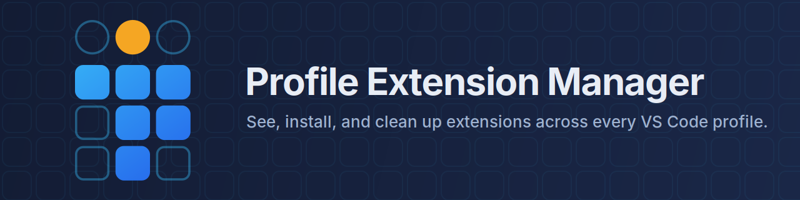

# Personas

Easily manage your dev personas: the different Git identities, VS Code profiles, and extensions that you need in different contexts.

## Features

Easily see and manage which extensions are installed in each VS Code profile, and compare them with
the effective extension status of the current workspace, all from one convenient matrix.

- **Profile x extension matrix**: Show every profile as a column and every extension as a row. Toggle any cell to install or uninstall the extension for that profile.
- **Current workspace status**: When a folder or workspace is open, a visually separate, read-only column reports `Enabled`, `Not enabled`, `Not installed in profile`, `Workspace-local`, or `Unknown` from supported VS Code evidence.
- **Local workspace extensions**: Valid unpacked extensions under `.vscode/extensions` appear as candidates, including workspace-only rows. Personas calls one installed only when VS Code reports that exact local path as effective.
- **Cross-profile install/uninstall**: Act on any profile directly from the matrix; you never have to switch into a profile just to add or remove an extension from it.
- **Orphan cleanup**: Find extension versions on disk that no profile references, review them (size, last modified), and move them to the Trash/Recycle Bin.
- **Privacy**: This extension never collects or transmits any data.

## Requirements & Limitations

- VS Code Stable or Insiders on Windows, macOS, or Linux.
- Portable installations and custom `--user-data-dir`/`--extensions-dir` are supported.
- Remote workspaces (SSH, WSL, containers, github.dev) are not managed. Personas manages the local desktop install it runs in.

## Profiles, workspaces, and recommendations

Ordinary Marketplace and VSIX extensions are installed per VS Code profile. VS Code can then
enable or disable an installed extension globally or for the current workspace. Personas keeps
those concepts separate: profile columns remain editable installation manifests, while the
**Current workspace** card and matrix column report effective status without changing enablement.

A saved `.code-workspace` file is shareable JSON configuration. Its Current workspace card can
open a read-only preview or edit that manifest directly. VS Code's internal extension-enablement
state is not stored in that file, so those manifest actions do not enable, disable, install, or
remove extensions.

VS Code also supports local workspace extensions under `.vscode/extensions`. Merely placing an
unpacked manifest there creates a candidate, not proof of installation. Personas reports
`Workspace-local` only when the stable VS Code API exposes the same extension ID from inside that
candidate directory. A candidate without that evidence remains `Unknown`.

Extension recommendations in `.vscode/extensions.json` or a `.code-workspace` file are suggestions
only. Personas never treats a recommendation as installed or enabled. `Unknown` likewise means the
stable APIs or readable profile data cannot support a stronger claim; it is not a guessed disable
or install state.

## How It Works

Personas reads the same files VS Code itself maintains: the profile registry and each profile's extension list. All installs and uninstalls run through the official `code` command-line interface, scoped to the right profile (and, when applicable, the right `--user-data-dir`/`--extensions-dir`). Workspace status additionally uses the stable `vscode.extensions` API and a bounded read-only scan of immediate child directories under each local workspace root's `.vscode/extensions` folder. Personas does not read or write VS Code's SQLite state.

## Releasing (maintainers)

Releases are automated with [release-please](https://github.com/googleapis/release-please) and driven by conventional commits: commits merged to `main` accumulate into a bot-managed release PR that maintains `CHANGELOG.md` and the version bump; merging that PR tags the release and publishes a GitHub Release with the packaged `.vsix` attached. No manual version edits or manual `vsce publish` are part of the normal flow.

- Local packaging: `npm run package` builds a `.vsix` into `releases/` (gitignored, not committed).
- Marketplace publishing runs automatically on each release via the `VSCE_PAT` repository secret (rotate before expiry — a failed publish step is the symptom). Manual fallback: `npx vsce publish --packagePath <released .vsix>`.
